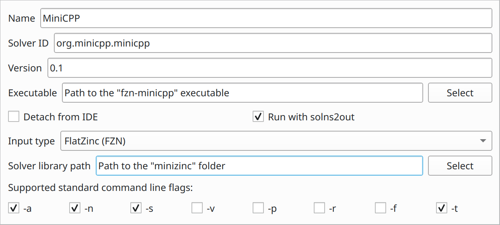

fzn-minicpp
===
A C++ constraint solver based on [MiniCP][minicp], compatible with [MiniZinc][minizinc].

Build
--
You can build *fzn-minicpp* as follows:

1. Clone this repository and its submodules ([libfzn], [libminicpp]) using Git:

```
git clone --recurse-submodules https://bitbucket.org/constraint-programming/fzn-minicpp
```

2. Build the executable using CMake:

```
mkdir build
cd build
cmake .. -DCMAKE_BUILD_TYPE=Release
make
```


Installation
--
You can add *fzn-minicpp* to the MiniZinc IDE as follows:

1. From the toolbar: MiniZinc > Preferences > Solver > Add new...

2. Configure as illustrated:

   

[minicp]: https://doi.org/10.1007/s12532-020-00190-7 "MiniCP: A lightweight solver for constraint programming"
[minizinc]: https://www.minizinc.org
[libfzn]: https://bitbucket.org/constraint-programming/libfzn
[libminicpp]: https://bitbucket.org/constraint-programming/libminicpp